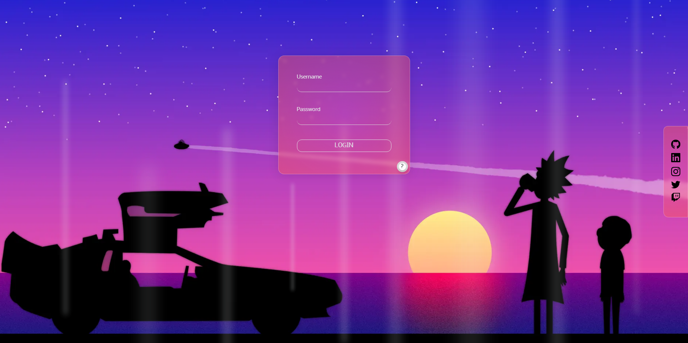
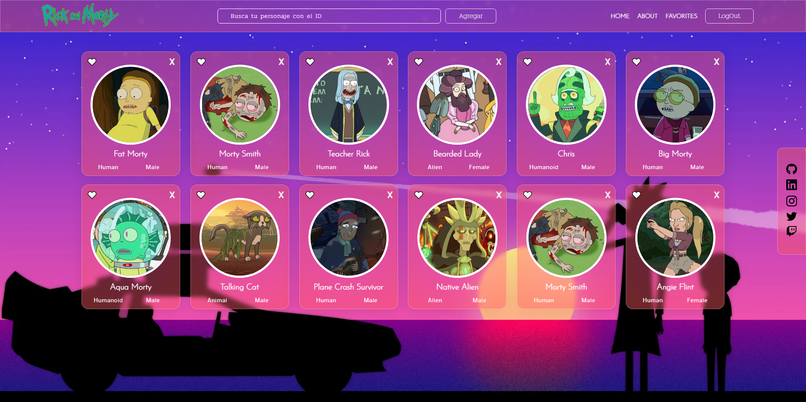
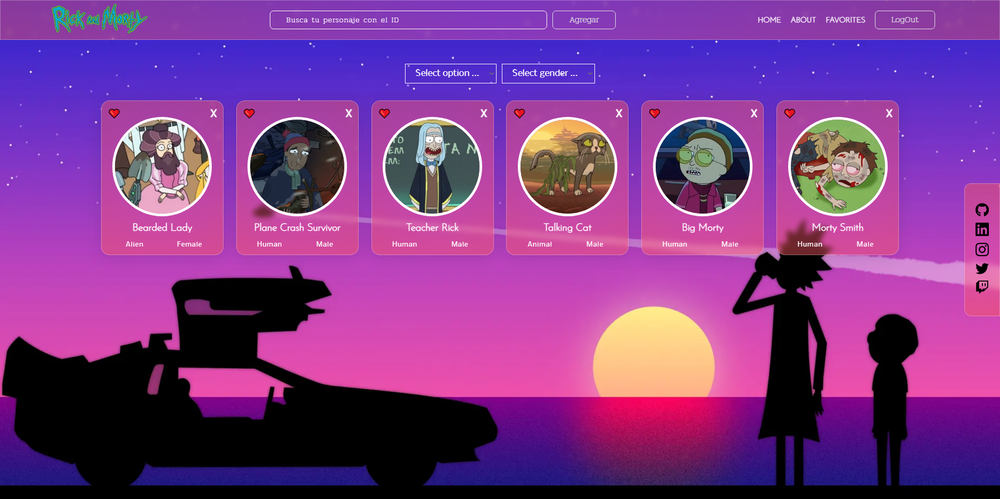
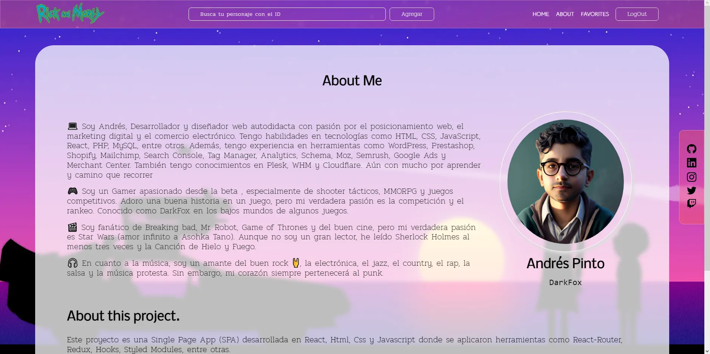

# Rick and Morty - React App

## Visualizalo en https://rick-and-morty-henry.netlify.app

 

Acceso:  
user: user@rickymorty.com 
pass: 123asd

 
Este proyecto es una Single Page App (SPA) desarrollada en React, Html, Css y Javascript donde se aplicaron herramientas como React-Router, Redux, Hooks, Styled Modules, entre otras.

La página funciona de la siguiente manera:

- Te diríges al search y pones un "ID" que puede ser un numero entre el 1 y el 826, luego pulsas "Agregar" para que te renderice la tarjeta de cada personaje, la cual podras añadir a favoritos o dar click en el nombre para ver sus detalles o eliminarla dandole a la x para que te la borre del listado de cards que haz buscado.

- Puedes seguir agregando las "Cards" que desées y jugando con ellas .

- Puedes navegar en "Details Cards", donde encontrarás mas información detallada sobre las "Cards" y en "About We" , que ésta última es dónde te encuentras..

## Capturas

 
 
 

 
 
 

 
 
 

 
 
 
Este proyecto llevo muchas horas y mucho amor, tu valoración significa mucho.
